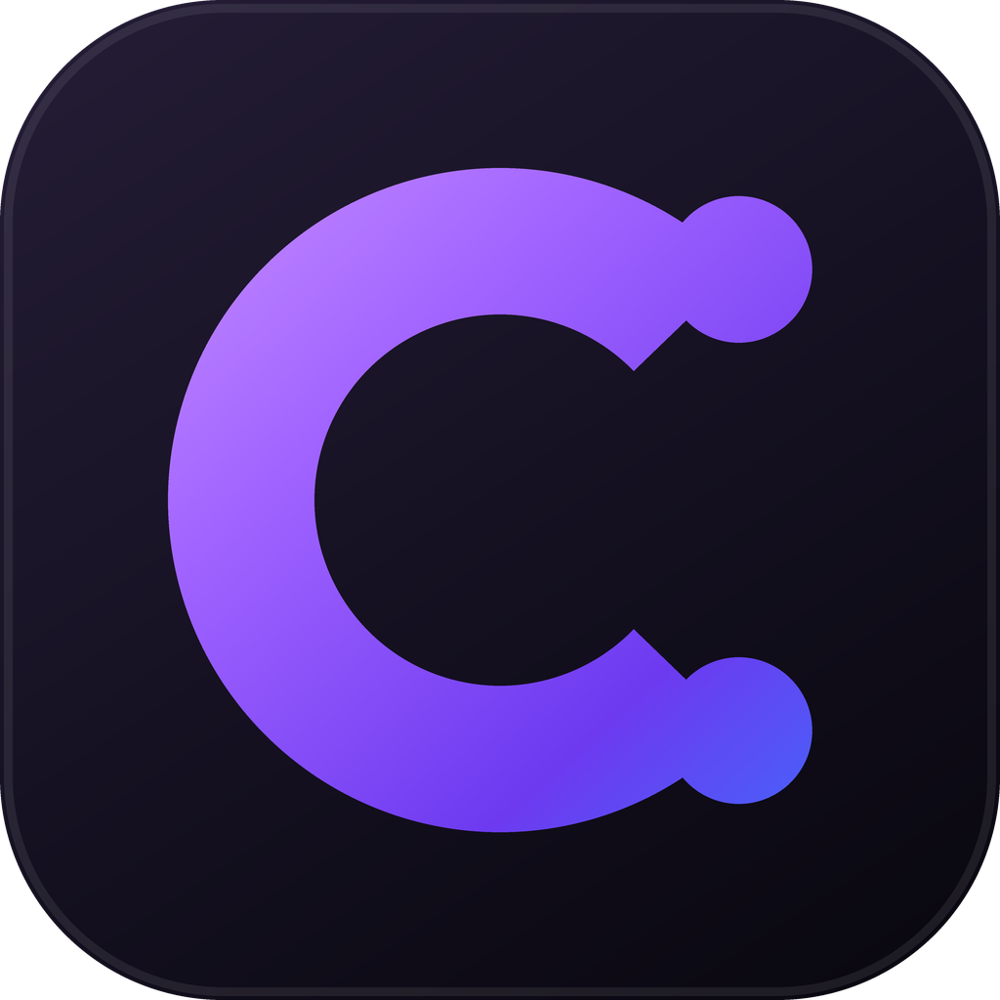
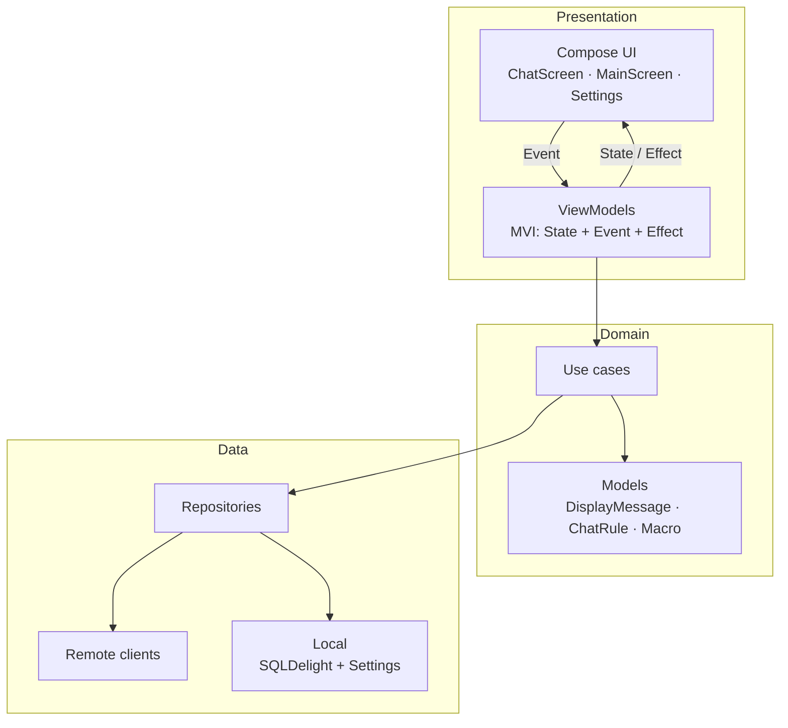
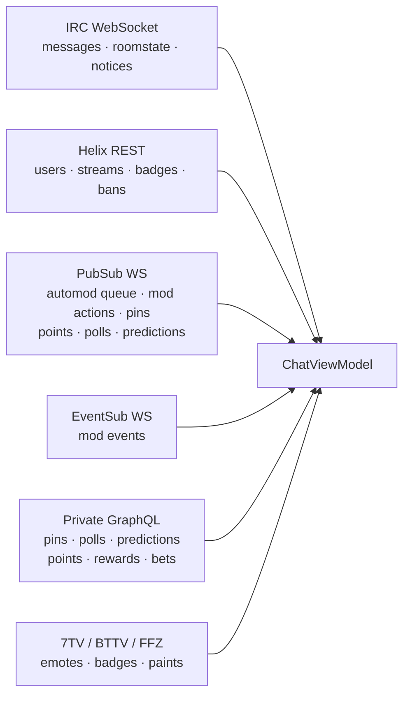

<div align="center">



# Chatone

**A power-user Twitch chat client for streamers and moderators.**
One Kotlin codebase → Windows, macOS, Linux and Android.

[](https://kotlinlang.org)
[](https://www.jetbrains.com/lp/compose-multiplatform/)
[](https://ktor.io)
[](#-platform-support)
[](LICENSE)
[](https://github.com/Rudione/Chatone/releases/latest)

[Download](#-download) · [Features](#-features) · [Architecture](#-architecture) · [Build](#-building-from-source)

</div>

---

## 📸 Screenshots


| Multi-chat | Moderation | Themes |
|:--:|:--:|:--:|
|  |  |  |

| Predictions & polls | AI assistant | Mini-profile |
|:--:|:--:|:--:|
|  |  |  |

---

## ✨ Features

### 💬 Chat

- Real-time IRC chat with **multi-channel** support and per-channel scrollback
- **Multi-chat panels** — several channels side by side, drag & drop layout, cross-channel mentions
- Chat history preloaded on join (retries with backoff, merged with live messages rather than replacing them)
- Reply threads, message pinning, repeated-message counter
- Inline image previews (on / off / blur), link hover previews, Twitch clip cards
- Slash-command suggestions, custom **chat commands** and **macros** with pinned quick-buttons
- **Message translation** — right-click any message, no API key required
- Chat search (`Ctrl/Cmd+F`), pause-on-hover or pause-by-hotkey, unread counter

### 😀 Emotes & cosmetics

- **7TV, BTTV and FFZ** emotes, animated emotes included
- 7TV **paints** rendered inline on nicknames (linear / radial / repeating gradients, shadows, animated shift)
- 7TV badges, personal emote sets, live emote-set updates over the 7TV EventAPI
- Emote picker with search, tabs and tooltips

### 🛡️ Moderation

- Timeout presets, ban / unban, delete, mod / unmod, VIP / un-VIP, `/nuke`
- **Reorderable custom mod-action buttons** with per-button durations and labels
- Moderation panel for live room settings (slow, followers-only, subs-only, emote-only, R9K)
- AutoMod queue with allow / deny, plus "who deleted this" attribution via PubSub mod actions
- Built-in **local Automod** engine:
  - Word filters — alternates, regex, whole-word, case sensitivity
  - Behavioral rules — spam rate, all-caps, links, emote spam, new accounts, duplicates, consecutive numbers
  - Event triggers — stream online/offline, first message, raid welcome
  - Global or per-channel scope, exemptions for mods / VIPs / subs
  - Import / export as JSON, CSV or XLSX

### 🎲 Broadcaster tools

- **Polls** and **Predictions** — create, vote, place bets, lock and resolve, all from chat
- Custom bet dialog with a bank slider, percentage presets and live payout ratio
- Unified event banner with a countdown ring and a carousel when several events are live
- Channel Points & Bits sheet — reward grid, redeem with text input, auto-claim bonus points
- Raid start / cancel with countdown, shoutouts, announcements

### 🤖 AI assistant

- Any **OpenAI-compatible** endpoint: OpenAI, Anthropic, xAI, DeepSeek, Qwen, or local **Ollama**
- Built-in model downloader for local models (llama3.2, qwen2.5, gemma2, phi3, mistral, deepseek-r1)
- Quick presets — chat summary, mood, my mentions, risky messages, suggest a reply, stream idea
- Background scanner that **highlights** suspicious messages on a schedule
- Can propose a local Automod rule — **you approve it before anything is applied**

> The assistant has **no moderation powers**. It cannot ban, time out, delete or send messages.
> Its only write path is a rule proposal behind an explicit approve button.

### 👤 User mini-profile

- Avatar, badges, roles, account age, follow date, subscription age (via IVR)
- Per-user notes, local nicknames, mention muting (globally or per channel)
- Chatterino-style message history with right-click copy
- Detachable into its own window

### 🎨 Look & feel

- Material 3 Expressive with glassmorphism / liquid-glass surfaces
- Theme creator: accent + base pair, seed colour → full scheme, custom accent palettes
- **Every** chat-highlight, moderation and automod colour is editable in one place
- Wallpaper backgrounds with blur, per-panel colours, optional glow effects
- Custom fonts, italic / underline / strikethrough, font and UI scaling
- Adjustable message density and line height, configurable title bar, Streamer Mode

### 👥 Accounts

- Multiple accounts with independent IRC connections and instant switching
- Per-account settings profiles, swapped automatically on switch
- Optional **first-party token** (device-auth flow) that unlocks moderator-side polls, predictions and pins
- Per-account proxy support

### 🔔 Notifications

- Highlight rules — username, keywords, subscriptions, whispers, first message, channel points
- Mentions feed, whispers panel, custom mention sound, system notifications, tray + live alerts

### ⚙️ Extras

- Detached windows on desktop — profile, settings, automod, prediction resolver
- Image uploader with drag & drop to a custom host
- Streamlink integration (best / 720p60 / 480p / audio-only)
- Localization: **English & Russian**
- Auto-updater wired to GitHub Releases

---

## 🖥️ Platform support

| Platform | Status | Notes |
|---|---|---|
| Windows | ✅ Supported | Custom title bar, Snap Assist, tray icon |
| macOS | ✅ Supported | `.dmg`, native window chrome |
| Linux | ✅ Supported | `.deb` |
| Android | ✅ Supported | `.apk` |
| iOS | 🚧 Source only | Targets are disabled in `composeApp/build.gradle.kts` — `navigation3-ui` ships Kotlin/Native ABI 2.3.0 klibs that the Kotlin 2.2.20 toolchain cannot read. Re-enable once the project moves to Kotlin 2.3.x + CMP 1.11.x. All `iosMain` actuals are already written. |

---

## 📥 Download

Grab an installer from the [**Releases page**](https://github.com/Rudione/Chatone/releases/latest).

| File | Platform |
|---|---|
| `Chatone-<version>.msi` | Windows installer |
| `Chatone-<version>-portable.zip` | Windows portable |
| `Chatone-<version>.dmg` | macOS |
| `chatone_<version>-1_amd64.deb` | Linux (Debian / Ubuntu) |
| `Chatone-<version>.apk` | Android |

> The **Actions** tab holds CI artifacts and needs a GitHub account. Always use **Releases**.

---

## 🏗 Architecture

Clean Architecture over Kotlin Multiplatform. The UI is 100 % shared Compose; only platform I/O is `expect/actual`.



### Where the data comes from

Chatone talks to five different Twitch surfaces, because no single one covers everything a moderator needs:



- **IRC** — the message stream itself.
- **Helix** — everything with an official, documented endpoint.
- **PubSub** — live pushes for the AutoMod queue, mod actions, pinned chat, channel points, and `polls.*` / `predictions-channel-v1.*`.
- **EventSub** — mod-side events Helix cannot push.
- **Private GraphQL** — only for what Helix genuinely does not expose to moderators: pinning, creating and resolving polls / predictions, channel-point rewards, placing bets. Needs the optional first-party token.

### Source layout

```
composeApp/src/
├── commonMain/kotlin/io/rudione/chatone/
│   ├── data/
│   │   ├── remote/        TwitchIrcClient · TwitchApiClient · TwitchGqlClient
│   │   │                  TwitchPubSubClient · TwitchEventSubClient
│   │   │                  AiAssistantClient · OllamaClient · 7TV/BTTV/FFZ
│   │   ├── local/         SQLDelight database + SchemaHealer
│   │   └── repository/    Chat · Emote · Badge · Automod · Mentions · AI …
│   ├── domain/            models · use cases · entitlements
│   ├── presentation/
│   │   ├── chat/          ChatScreen, components/, rendering/, multichat/, moderation/
│   │   ├── main/          MainScreen, sidebar/, mentions, whispers
│   │   ├── settings/      sections/ + components/
│   │   ├── ai/            assistant panel, setup, actions
│   │   ├── automod/       rule editor
│   │   ├── components/    ChatoneTextField · ChatoneScrollbar · LiquidGlassSurface …
│   │   ├── theme/         ChatoneTheme · AccentPalettes · i18n
│   │   └── window/        custom chrome, detached windows
│   └── util/              chat · emote · automod · media · system · icons
├── androidMain/  ─┐
├── desktopMain/   ├─ expect/actual: files, fonts, links, notifications, windows
└── iosMain/      ─┘
```

### Design decisions worth knowing before you touch the code

| Decision | Why |
|---|---|
| **`SchemaHealer` instead of `.sqm` migrations** | New tables and columns are reconciled at startup. Anything added to a `.sq` file **must** also go into `SchemaHealer`, or upgrades crash. |
| **`ChatoneIndication` replaces the M3 ripple** | One global interaction feel; it has to sit inside `MaterialTheme`. |
| **A single `ChatoneColorTokens` source** | Chat, moderation and automod accents come from one configurable place instead of three. |
| **Scroll pinning via `stickToBottomExact`** | All scroll targets index `dedupedMessages`; ad-hoc `scrollToItem` calls drift. |
| **`chatoneGlassPanel` modifier** | The pin / poll / prediction card treatment lives in one modifier so every floating panel stays identical. |
| **Hotkeys muted while typing** | `GlobalKeyDispatcher` counts focused text fields and stops dispatching, so `Cmd/Ctrl+A`, `+C`, `+V` reach the field instead of an app shortcut. |

---

## 🔧 Building from source

### Requirements

- **JDK 17+**
- **Android SDK** (only for the Android target)
- macOS with Xcode if you re-enable the iOS targets

### Commands

```bash
# Run the desktop app
./gradlew :composeApp:run

# Compile only (fast check)
./gradlew :composeApp:compileKotlinDesktop

# Desktop installers → build/compose/binaries/main-release/
./gradlew :composeApp:packageReleaseDistributionForCurrentOS

# Windows portable zip → build/distributions/
./gradlew :composeApp:packagePortableZip

# Android
./gradlew :composeApp:assembleRelease
```

Version and version code live in `gradle.properties` (`app.version`, `app.versionCode`).
Dependency versions are declared inline in `settings.gradle.kts`.

### Stack

| Layer | Library |
|---|---|
| UI | Compose Multiplatform 1.10.3, Material 3 Expressive |
| Language | Kotlin 2.2.20, JVM target 17 |
| Networking | Ktor 3.1.1 (OkHttp / Darwin engines) |
| DI | Koin 4.0.0 |
| Database | SQLDelight 2.0.2 |
| Images | Coil 3.1.0 |
| Serialization | kotlinx.serialization 1.7.3 |
| Logging | Napier |

---

## 🎯 Getting started

1. **Log in** — launch the app, press *Login with Twitch*, authorize in the browser, come back.
2. **Add channels** — type a channel name in the sidebar search and pick a result.
3. **Chat** — type at the bottom, send with `Enter`.
4. **Add more accounts** — the `+` button in the sidebar; each account keeps its own connection and settings profile.
5. *(Optional)* **First-party token** — Settings → Account. Unlocks pinning, polls and predictions while you are a moderator rather than the broadcaster.

### Handy shortcuts

| Shortcut | Action |
|---|---|
| `Ctrl/Cmd + F` | Search in chat |
| `Ctrl/Cmd + A` | AutoMod window (when the message box is not focused) |
| `Ctrl/Cmd + M` | Mentions feed |
| `Alt + Shift + B` | Ban with a saved reason |
| Configurable | Pause chat (hold or toggle) |

More hotkeys, including per-command bindings, live in Settings → Hotkeys.

---

## 🔐 Permissions & privacy

| Scope | Purpose |
|---|---|
| `chat:read` | Read chat messages |
| `chat:edit` | Send messages |
| `user:read:email` | Load your profile |
| `channel:read:subscriptions` | Show subscription status |
| `moderator:*` | Moderation actions, when you are a mod |

Everything stays on your machine: accounts and tokens, favourite channels, settings, optional chat history, AI threads. Nothing is sent to any Chatone server — there isn't one. If you configure a cloud AI provider, only the chat snapshot you ask about goes to that provider.

---

## 🤝 Contributing

Issues and pull requests are welcome — please open an issue first for anything large.

House rules for code:

- **No comments in Kotlin sources.** Name things so a comment is unnecessary.
- Keep files under ~500 lines; split into `components/` when they grow.
- Any new `.sq` table or column also goes into `SchemaHealer`.
- Text fields use `ChatoneTextField`, not `OutlinedTextField` — except the chat message box.

---

## 📄 License

MIT — see [LICENSE](LICENSE).

> Chatone is a community-built client and is not affiliated with Twitch Interactive.

<div align="center">

**Chat smarter. Stay connected.** 🎮💬

</div>
