

# Chatone — portfolio

**Smart chat client. Watch, chat, moderate and explore – all your streaming tools in one app.**
Kotlin Multiplatform · Compose Multiplatform · desktop, Android, iOS from one codebase.

[Website](https://app.chatone.im/) · [Source](../../README.md) · [Telegram](https://t.me/rudionee)

**English** · [Русский](#русский)

---

## The product

Chatone is a smart chat client for Twitch: watch the stream, chat, moderate and find the next channel without switching apps.
It covers the whole stream, from the viewer's seat to the moderator's and the streamer's.

- **Multi-chat** — channels in folders, several chats side by side, mentions from every channel in one feed
- **Moderation at chat speed** — custom timeout buttons that appear on hover, room modes and macros one click away, an inline AutoMod queue
- **Local automod** — word filters and chat rules checked on the device the moment a message arrives: delete, time out or ban, with an automatic reply to the author
- **Watch and explore** — a low-latency player above the chat, side or see-through overlay chat in landscape, picture-in-picture with a latency readout; Following, Popular and Categories to find the next stream
- **Events inside the chat** — polls, predictions and pinned messages as banners with a countdown ring, a bet dialog with a bank slider, hide any event just for yourself
- **7TV, BTTV and FFZ** — animated emotes, 7TV paints on nicknames, an emote picker with search and per-provider tabs
- **AI assistant** — chat summary, mood and risky messages from any OpenAI-compatible model or a local one; read-only by design
- **Your look** — accent + base palettes, wallpapers with blur and dimming, fonts, density and UI scale

## What I built

| Area | Details |
|---|---|
| Architecture | Clean Architecture over KMP, MVI view models, `expect/actual` only for platform I/O, Koin DI, SQLDelight with a startup schema healer |
| Twitch integration | IRC over WebSocket, Helix, PubSub, EventSub and private GraphQL — each used only for what the others cannot do |
| Chat rendering | Lazy list pinned to the bottom with user-intent detection: one line of manual scroll pauses the feed, a glass input bar fades in as soon as a message slides under it |
| Moderation UX | Reorderable mod buttons, hover-only mode on desktop, room modes, AutoMod queue, a local rule engine with import / export |
| Mobile | Edge-to-edge layout, keyboard-aware input, a low-latency stream player above the chat, side or overlay chat in landscape, picture-in-picture, sheets for tools, floating mini-profile |
| Explore | Following, Popular and Categories with paging, filters by language, tags and viewers; one tap opens the chat and the player |
| Security | Secrets in the OS keychain (AES-GCM + Keychain / DPAPI / libsecret / Android Keystore), signed updates, SSRF guard for link previews, strict link validation |

## Gallery

| | |
|:--:|:--:|
| 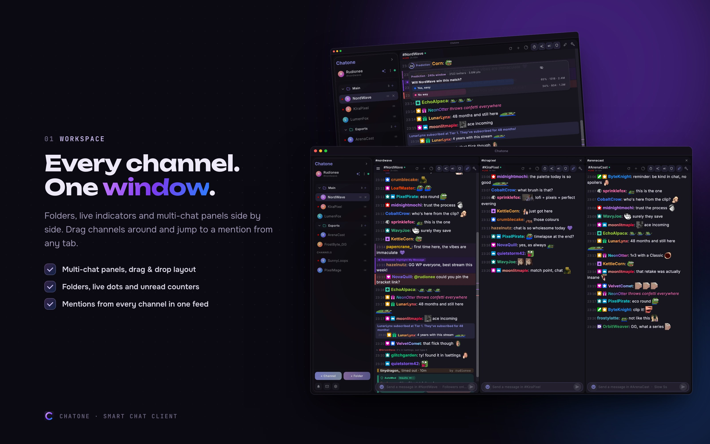 | 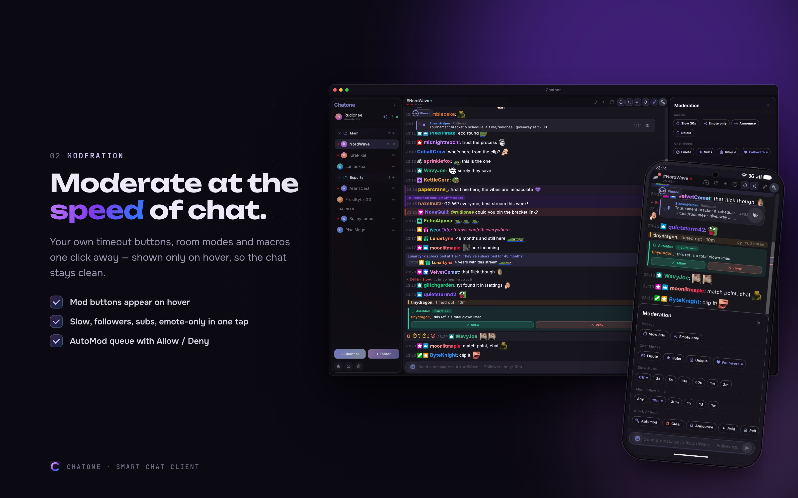 |
| 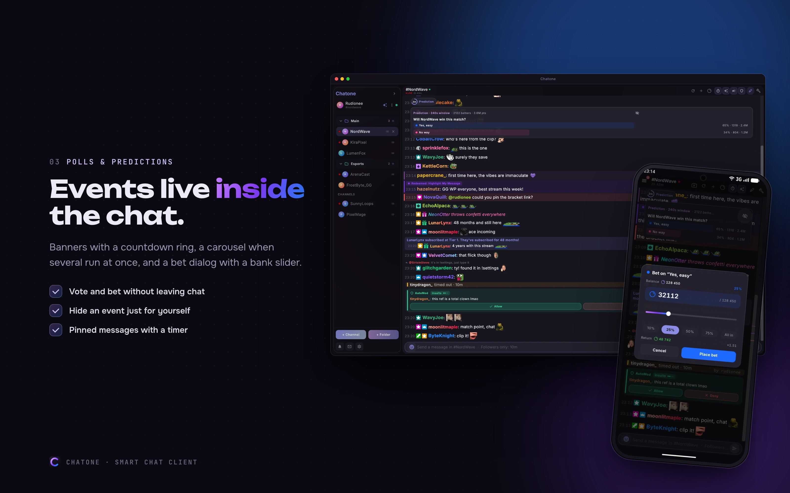 | 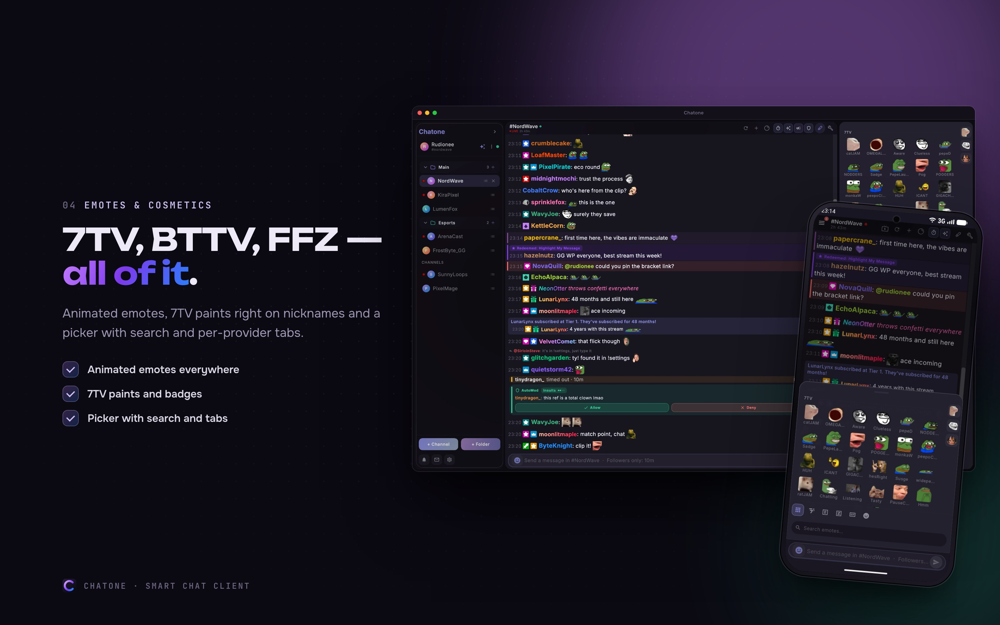 |
| 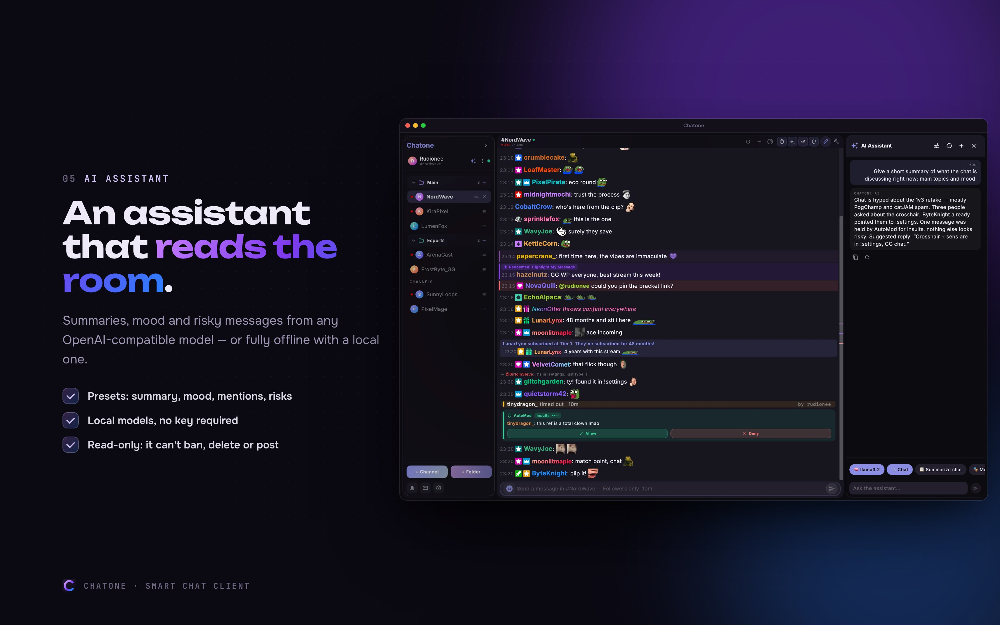 | 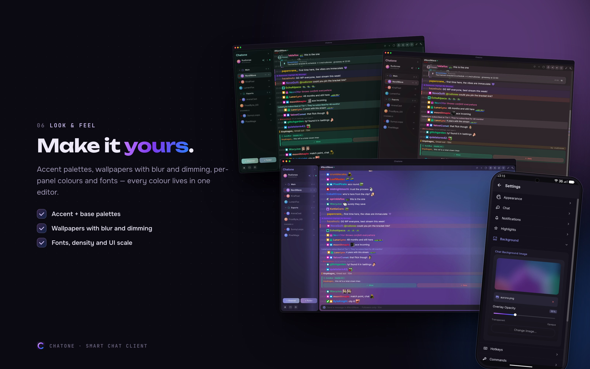 |
| 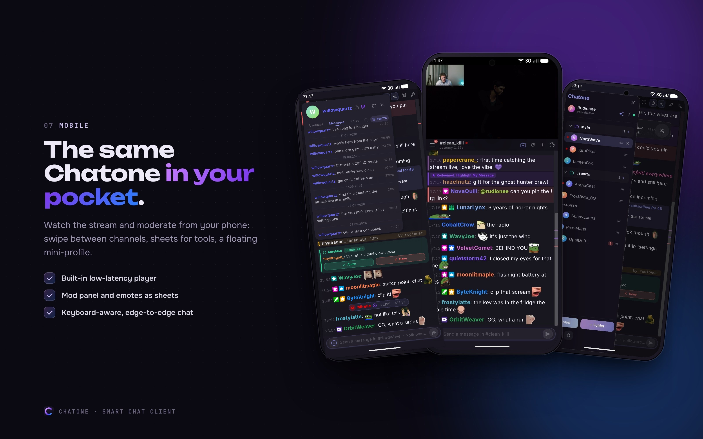 | 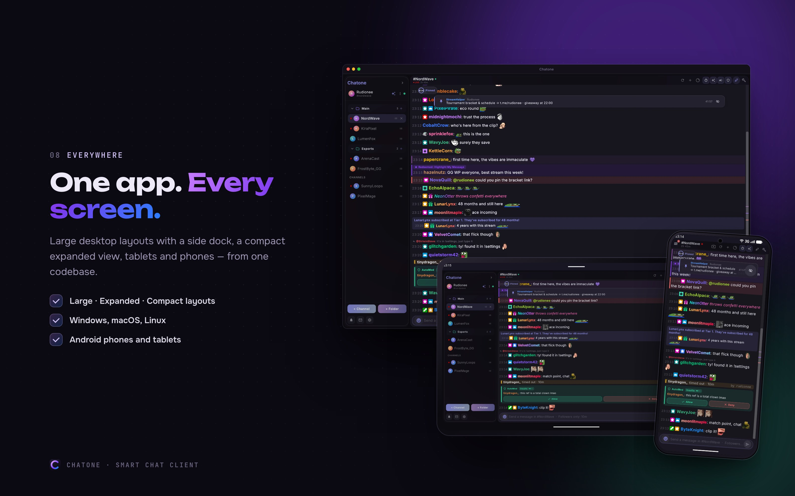 |
| 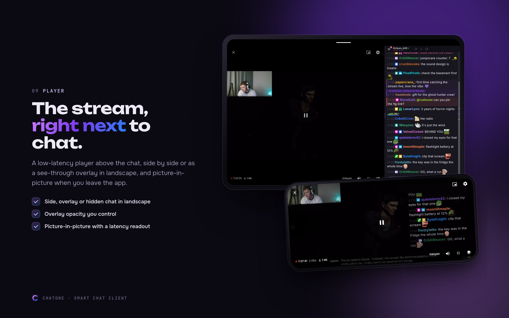 | 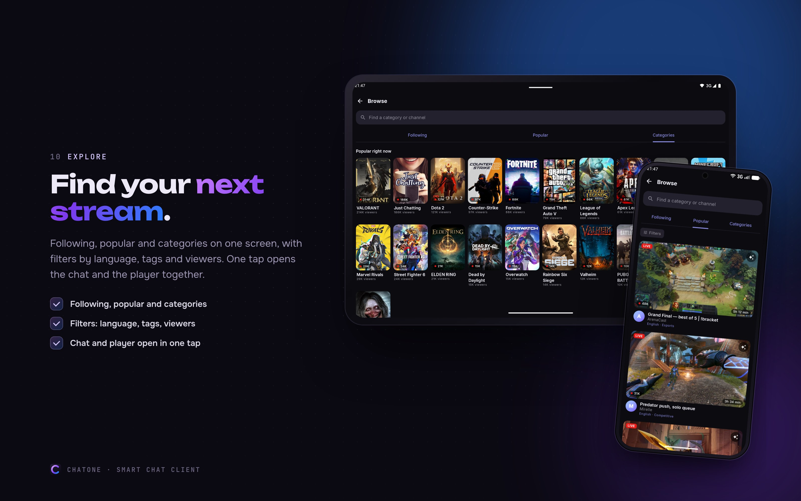 |
| 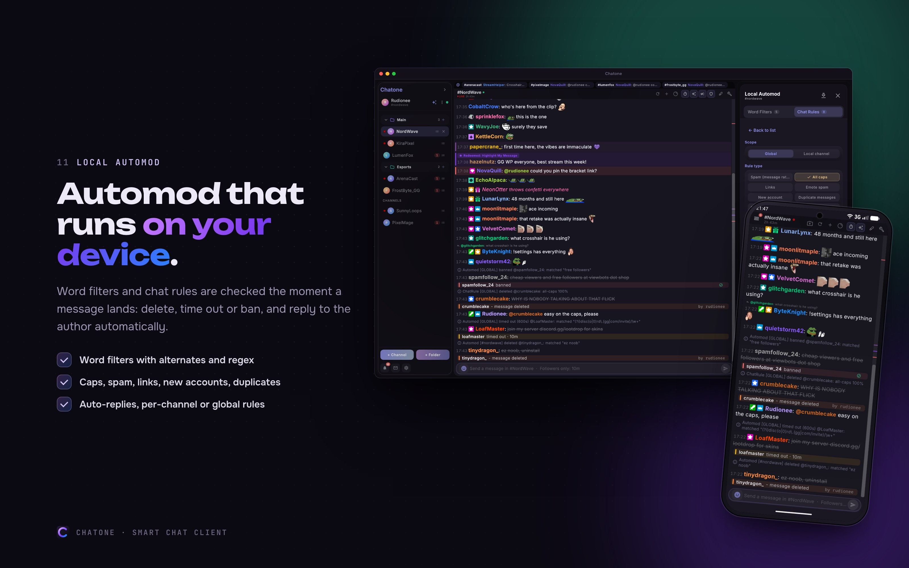 | |

  

## Assets

| Folder | Contents | Size |
|---|---|---|
| `screens/desktop/{en,ru}` | Desktop app: main window, hover mod buttons, moderation dock, multi-chat, prediction, poll, emote picker, AI assistant, settings, wallpaper, local automod dock (word filters, chat rules); accent palettes (en) | 3200×2000, expanded 1920×1520 |
| `screens/phone/{en,ru}` | Android phone: chat, drawer, mod panel, prediction, bet, poll, emotes, mini-profile, AI, settings, appearance, wallpaper, stream, explore (following, popular, categories), local automod (chat, rules, rule) | 1080×2400 |
| `screens/phone/{en,ru}` | Landscape: stream with side chat, see-through overlay chat | 2400×1080 |
| `screens/tablet/{en,ru}` | Android tablet: chat, docked emote picker, stream with side chat, explore, categories, local automod dock; overlay chat (en) | 2560×1600 |
| `screens/tablet/{en,ru}` | Portrait tablet: stream above the chat | 1600×2560 |
| `slides/{en,ru}` | Presentation: cover + 11 feature slides | 3200×2000 |
| `store/google-play` | 8 phone screenshots, 7 tablet screenshots (en) or 6 (ru), feature graphic, 512 icon | 1080×1920, 2560×1600, 1600×2560, 1024×500 |
| `store/app-store` | 8 iPhone + 7 (en) or 6 (ru) iPad screenshots, 1024 icon | 1290×2796, 2732×2048, 2048×2732 |
| `readme` | Hero banner per language, live-chat animation (GIF and WebP) | 3200×1800, 880 / 1200 wide |
| `og` | Link preview image per language | 1200×630 |

Store texts are in [`store-listing.md`](store-listing.md).

All nicknames, channels, viewer counts and chat messages are made up for these shots. Stream previews in Explore are official game screenshots and box art. The only real footage is the public broadcast playing in the player screenshots, with its sponsor banners and on-stream chat removed.

---

## Русский

**Умный чат-клиент. Смотрите, общайтесь, модерируйте и находите новое — все инструменты для стримов в одном приложении.**
Kotlin Multiplatform и Compose Multiplatform: десктоп, Android и iOS из одного кода.

### Продукт

Chatone — умный чат-клиент для Twitch: смотрите стрим, общайтесь, модерируйте и находите следующий канал, не переключаясь между приложениями.
Он закрывает весь эфир — от места зрителя до места модератора и стримера.

- **Мультичат** — каналы в папках, несколько чатов рядом, упоминания со всех каналов в одной ленте
- **Модерация со скоростью чата** — свои кнопки мута, которые появляются по наведению, режимы комнаты и макросы в один клик, очередь AutoMod прямо в ленте
- **Локальный автомод** — фильтры слов и правила чата проверяются на устройстве в момент прихода сообщения: удалить, замутить или забанить и сразу ответить автору
- **Смотреть и искать** — плеер с низкой задержкой над чатом, в горизонтали чат сбоку или полупрозрачный поверх, картинка в картинке с задержкой на экране; подписки, популярное и категории, чтобы найти следующий стрим
- **События внутри чата** — опросы, прогнозы и закрепы баннерами с кольцом отсчёта, диалог ставки с ползунком банка, любое событие можно скрыть только для себя
- **7TV, BTTV и FFZ** — анимированные эмоуты, пейнты 7TV на никах, пикер с поиском и вкладками
- **ИИ-ассистент** — сводка, настроение и рискованные сообщения от любой OpenAI-совместимой или локальной модели; только чтение
- **Свой вид** — палитры «акцент + база», обои с размытием и затемнением, шрифты, плотность и масштаб

### Что сделано

| Область | Подробности |
|---|---|
| Архитектура | Clean Architecture на KMP, MVI, `expect/actual` только для платформенного I/O, Koin, SQLDelight с восстановлением схемы при старте |
| Twitch | IRC по WebSocket, Helix, PubSub, EventSub и приватный GraphQL — каждый только там, где другие не справляются |
| Лента чата | Список прижат к низу и отличает прокрутку пользователя: одна строка вверх ставит ленту на паузу, стекло под полем ввода появляется, как только сообщение заезжает под него |
| Модерация | Переставляемые мод-кнопки, режим «по наведению» на десктопе, режимы комнаты, очередь AutoMod, локальный движок правил с импортом и экспортом |
| Телефон | Edge-to-edge, поле ввода едет с клавиатурой, плеер с низкой задержкой над чатом, чат сбоку или поверх в горизонтали, картинка в картинке, инструменты в шторках, плавающий мини-профиль |
| Обзор | Подписки, популярное и категории с постраничной загрузкой, фильтры по языку, тегам и зрителям; одно касание открывает чат и плеер |
| Безопасность | Секреты в системном хранилище (AES-GCM + Keychain / DPAPI / libsecret / Android Keystore), подписанные обновления, защита превью ссылок от SSRF, строгая проверка ссылок |

### Галерея

| | |
|:--:|:--:|
| 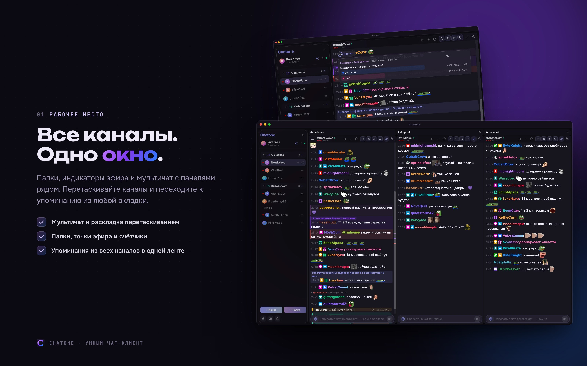 | 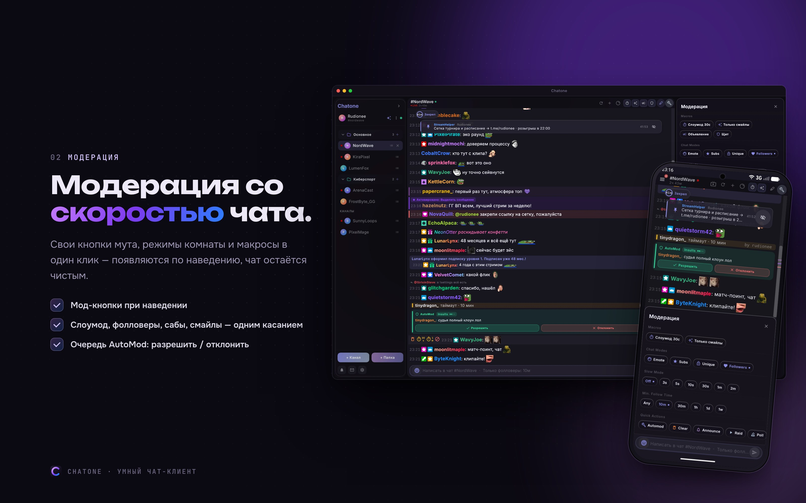 |
| 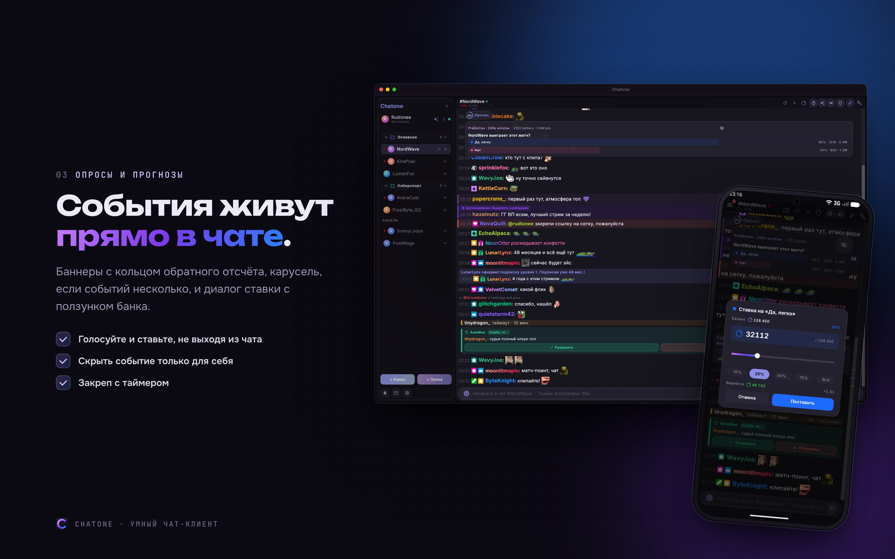 | 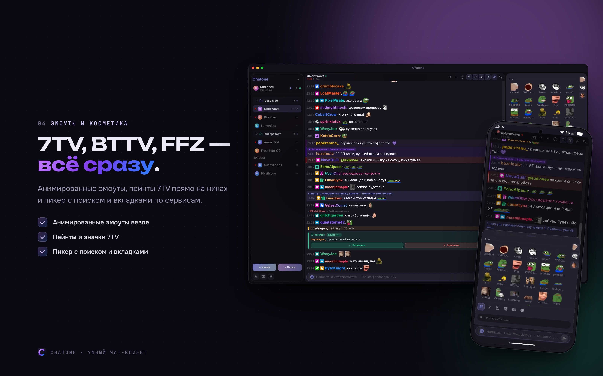 |
| 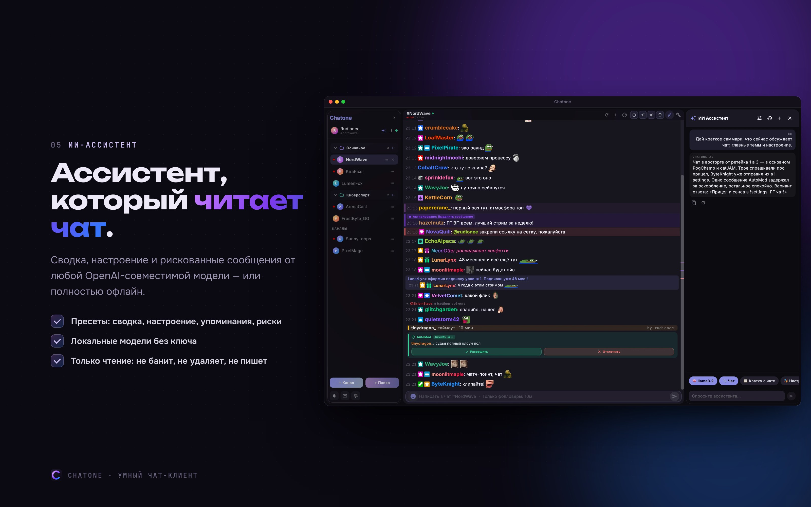 | 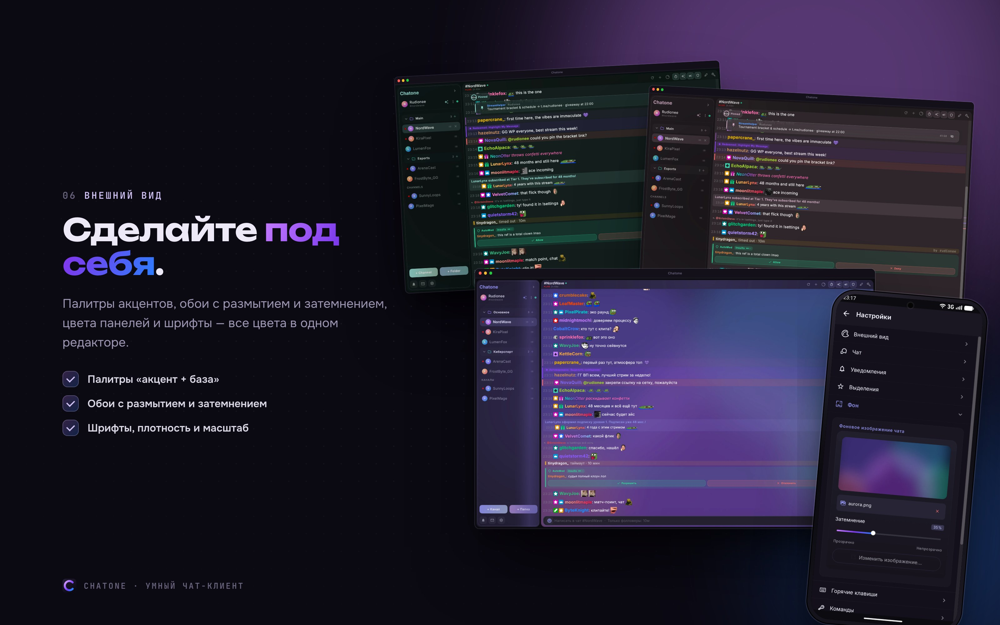 |
| 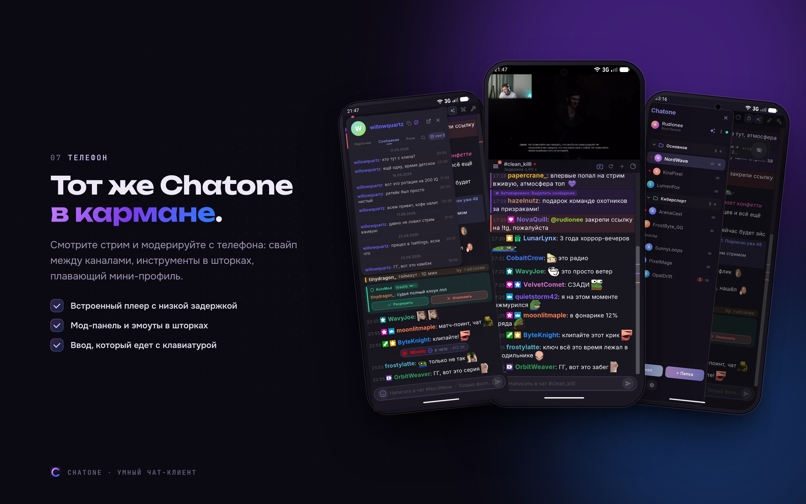 | 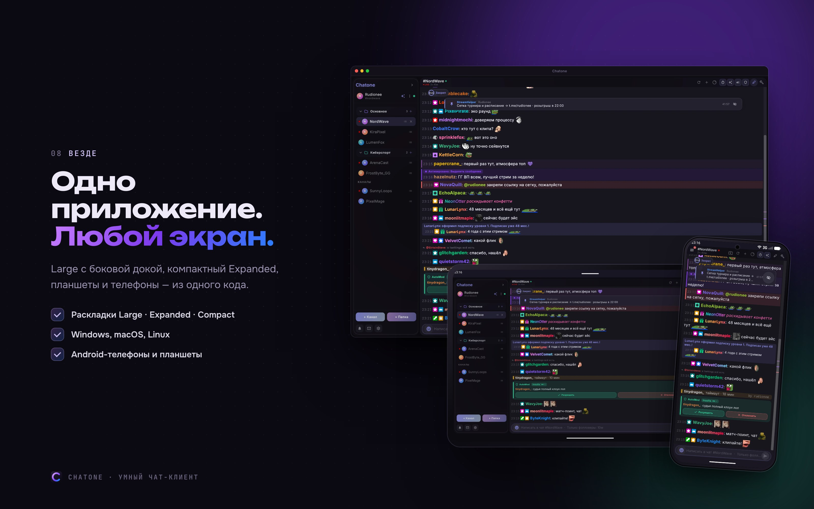 |
| 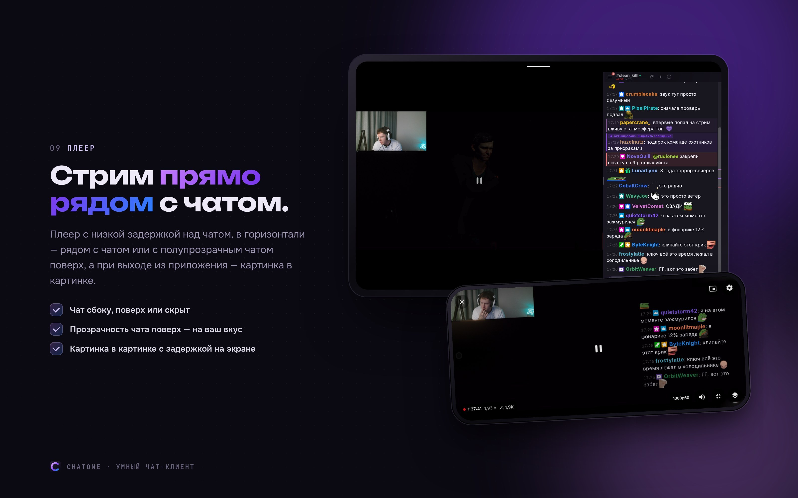 | 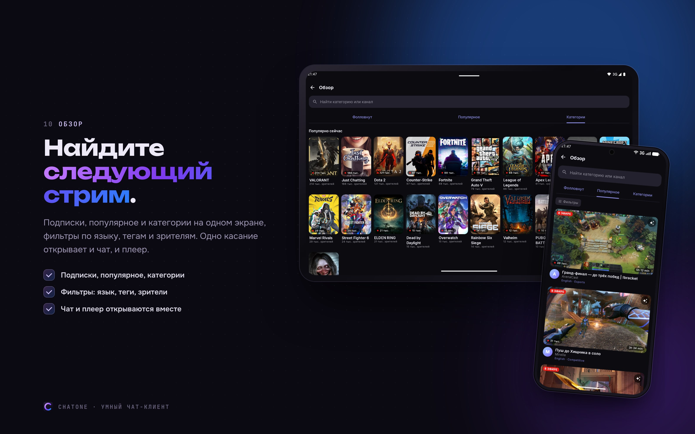 |
| 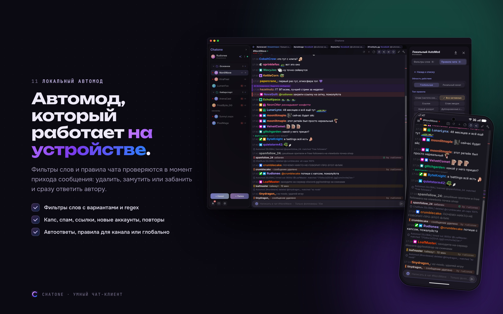 | |

Материалы разложены так же, как в таблице выше; русские версии лежат в папках `ru`. Тексты для магазинов — в [`store-listing.md`](store-listing.md).

Ники, каналы, число зрителей и сообщения в кадрах вымышленные. Превью стримов в обзоре — официальные скриншоты и обложки игр. Настоящая только публичная трансляция в кадрах с плеером; спонсорские баннеры и чат на самой трансляции убраны.

Связь: [Telegram](https://t.me/rudionee)
